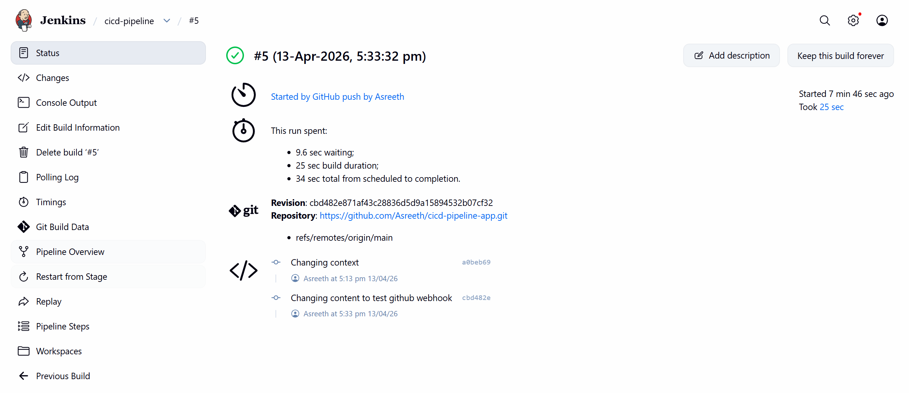
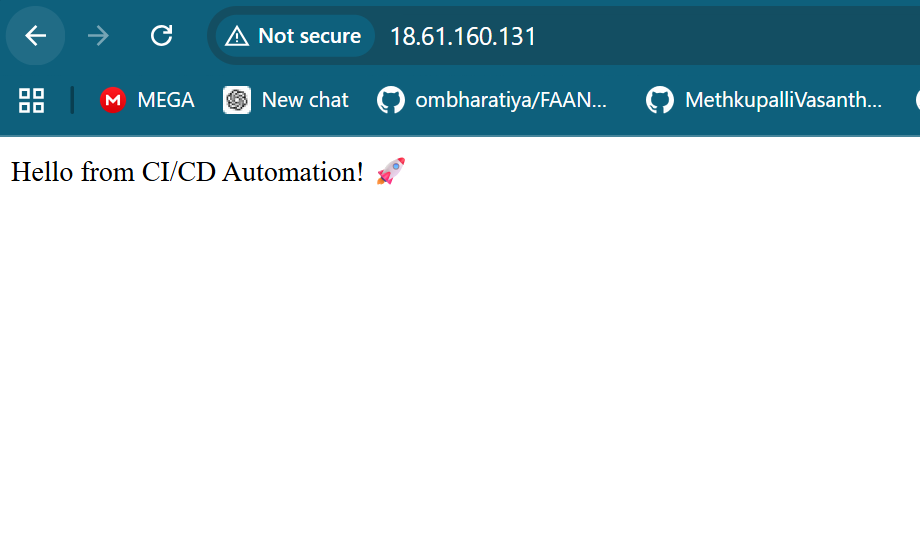

# AWS DevOps CI/CD Pipeline

A production-style CI/CD pipeline built on AWS that automatically builds, pushes, and deploys a Dockerized Flask application on every GitHub push.

## 🏗️ Architecture
```text
Developer → GitHub Push
↓
GitHub Webhook
↓
Jenkins Server (EC2)
├── Pull code from GitHub
├── Build Docker image
└── Push image to Amazon ECR
↓
Application Server (EC2)
├── Pull latest image from ECR
├── Stop old container
└── Run new container
↓
Live Application ✅
```

## 🛠️ Tools & Technologies

```text
| Category | Tool |
|---|---|
| Infrastructure | Terraform |
| Cloud | AWS (EC2, VPC, IAM, ECR) |
| CI/CD | Jenkins |
| Containerization | Docker |
| Image Registry | Amazon ECR |
| Language | Python (Flask) |
| Version Control | GitHub |
```

## 📁 Project Structure
```text
cicd-pipeline-app/
├── src/
│   ├── app.py              # Flask application
│   └── requirements.txt    # Python dependencies
├── terraform/
│   ├── ec2.tf              # EC2 instances configuration
│   ├── iam.tf              # IAM roles and policies
│   ├── main.tf             # Main Terraform configuration
│   ├── security_groups.tf  # Security groups
│   └── variables.tf        # Terraform variables
├── ci/
│   └── Jenkinsfile         # Jenkins pipeline definition
├── docs/
│   └── README.md           # Project documentation
├── Dockerfile              # Container definition
├── app-screenshot.png      # Application screenshot
└── jenkins-success.png     # Jenkins pipeline success screenshot
```

## ⚙️ Infrastructure (Terraform)

- Custom **VPC** with 2 public subnets
- **2 EC2 instances** — Jenkins Server and Application Server
- **IAM Role** with least-privilege ECR permissions
- **Security Groups** — port 8080 for Jenkins, port 80 for App

## 🔄 Pipeline Stages

1. **Clone** — Jenkins pulls latest code from GitHub
2. **Build** — Docker image built from Dockerfile
3. **Push to ECR** — Image tagged and pushed to Amazon ECR
4. **Deploy** — Jenkins SSHs into App Server, pulls latest image and runs new container

## 🚀 How to Run

### Prerequisites
- AWS Account
- Terraform installed
- GitHub account

### Steps

1. Clone this repo
```bash
git clone https://github.com/Asreeth/cicd-pipeline-app.git
cd cicd-pipeline-app
```

2. Provision infrastructure
```bash
cd terraform/
terraform init
terraform apply
```

3. Install Jenkins and Docker on Jenkins Server EC2

4. Configure Jenkins pipeline pointing to this repo

5. Add GitHub Webhook:
http://YOUR_JENKINS_IP:8080/github-webhook/

6. Push any code change — pipeline triggers automatically!

## 📸 Screenshots

### Jenkins Pipeline Success


### Live Application


## 🎯 Key Achievements

- Reduced manual deployment effort by **~80%** through full pipeline automation
- Implemented **zero-touch deployments** triggered automatically on every code push
- Followed **least-privilege IAM** principles for secure AWS access
- Built **containerized** application for consistent deployments across environments

## 📌 Tech Stack


```